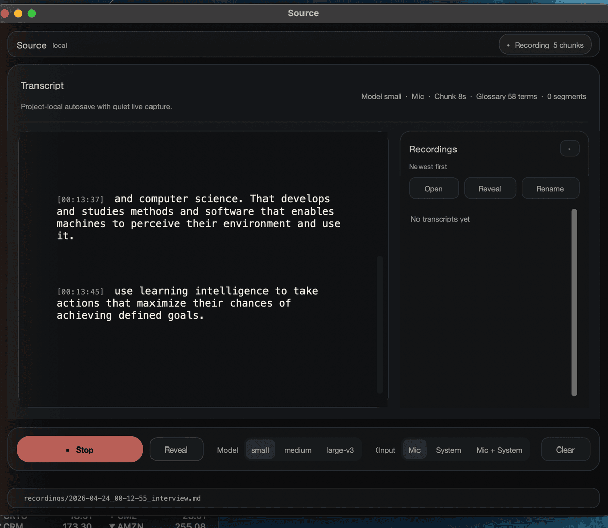

# Source

`source-transcriber` is a local-first macOS desktop wrapper for recording audio and producing live Markdown transcripts with `faster-whisper`.

This project is the desktop app, recording workflow, and file-management wrapper. It does not invent or ship a new speech model. Transcription is powered by `faster-whisper`, which runs OpenAI Whisper model weights through CTranslate2.

## Screenshot



## What It Does

- Records local audio from Mic, System, or Mic + System mode.
- Transcribes rolling chunks with a local Whisper model through `faster-whisper`.
- Autosaves Markdown and text transcripts while recording.
- Writes local audio sidecars for each session: mic/system source WAVs when applicable, a mixed WAV used for transcription, and session metadata JSON.
- Shows a lightweight local transcript history with Open, Reveal, and Rename actions.
- Runs locally after model files are downloaded.

## Current Scope

This is a focused v0.1. The goal is reliable local capture, not a full meeting assistant.

Included:

- Mic-only recording.
- System-only recording through BlackHole or an equivalent virtual audio device.
- Mic + System recording by capturing the microphone and BlackHole-style system audio separately, then mixing them for transcription.
- Local transcript history and safe local file actions.
- `small`, `medium`, and `large-v3` model choices.

Not included:

- Native macOS loopback capture through ScreenCaptureKit.
- Speaker diarization.
- Summaries or LLM analysis.
- Cloud sync, cloud transcription, or API-backed processing.
- Search, tags, databases, or project management features.

## Privacy And Consent

This app records audio. Make sure you have permission to record the conversation, meeting, interview, or system audio in your jurisdiction and context.

By default, audio and transcripts stay on your machine. The first use of a Whisper model may require internet access to download model files. After that download, transcription can run locally.

See `SECURITY.md` for the current security posture, dependency-audit commands, and local data handling notes.

## Upstream Attribution

- This app uses `faster-whisper`.
- `faster-whisper` runs OpenAI Whisper models using CTranslate2.
- OpenAI Whisper, faster-whisper, CTranslate2, SoundDevice/PortAudio, CustomTkinter, and BlackHole are separate upstream projects with their own licenses and maintainers.
- BlackHole is not bundled. It is only needed for System or Mic + System capture.

## Requirements

- macOS, tested on recent macOS versions.
- Python 3.10+.
- PortAudio support for `sounddevice`.
- Disk space for Whisper model files.
- Optional: BlackHole or equivalent virtual audio device for System and Mic + System modes.

## Install (Prebuilt, Apple Silicon)

For Apple Silicon Macs (M1 or newer). One command in Terminal:

```bash
curl -L https://github.com/GChaucer/source-transcriber/releases/latest/download/Source.zip -o /tmp/Source.zip && \
unzip -o /tmp/Source.zip -d /Applications && \
xattr -dr com.apple.quarantine /Applications/Source.app && \
open /Applications/Source.app
```

What it does: downloads the latest release zip, unpacks `Source.app` into `/Applications`, strips the macOS quarantine flag (the app is unsigned, so this skips the Gatekeeper warning), and launches it. On first launch macOS will ask for microphone permission once. The first transcription downloads the selected Whisper model (~150 MB for `small`).

Intel Macs are not supported by this build. For system audio capture, install BlackHole separately.

## Install From Source

```bash
cd ~/Desktop/InterviewTranscriber
python3 -m pip install -r requirements.txt
```

If `sounddevice` cannot find PortAudio:

```bash
brew install portaudio
python3 -m pip install sounddevice
```

## Run From Source

```bash
cd ~/Desktop/InterviewTranscriber
python3 app.py
```

When run from source, writable app data is stored in the project folder:

```text
recordings/
settings.json
debug.log
```

## Build The macOS App

This project uses PyInstaller for a double-clickable `.app` bundle.

```bash
cd ~/Desktop/InterviewTranscriber
python3 -m pip install pyinstaller
./build_macos_app.sh
```

The final app bundle is written to:

```text
dist/Source.app
```

You can move that app into `/Applications`. The app is unsigned, so macOS may require right-click → Open on first launch.

When run as a packaged app, writable data is stored in:

```text
~/Library/Application Support/Source/
```

That folder contains recordings, transcripts, settings, debug logs, and an optional user `glossary.txt`.

## Audio Modes

| Mode | Status | Behavior |
|---|---|---|
| Mic | Stable | Captures the default microphone input. |
| System | Experimental | Captures a BlackHole-style virtual system audio input only. |
| Mic + System | Intended interview mode | Captures default mic plus BlackHole-style system audio, writes separate source WAVs, and transcribes the mixed WAV stream. |

System audio currently requires manual macOS routing. Install BlackHole, then route the app/browser/interview audio output to BlackHole in System Settings or your audio routing tool. If no virtual system device is available, the app should fail before recording starts and show a clear message.

## Usage

1. Choose `Mic`, `System`, or `Mic + System`.
2. Choose `small`, `medium`, or `large-v3`.
3. Click Start Recording.
4. Click Stop to finalize the transcript.
5. Use the Recordings panel to open, reveal, or rename completed transcripts.

Current transcription defaults:

- Model: `small`
- Compute type: `int8`
- Language: `en`
- Default chunk length: `8s`

Model tradeoffs:

- `small` is the practical default for local CPU transcription.
- `medium` and `large-v3` may improve quality on harder audio.
- Larger models require larger first-time downloads and slower local inference.

## Output Files

Transcript files are written to `recordings/` from source runs, or to Application Support when packaged.

Each saved transcript uses YAML frontmatter:

```markdown
---
app: "Source"
created_at: "2026-04-23T16:15:44"
input_mode: "mic_system"
model: "small"
compute_type: "int8"
language: "en"
chunk_seconds: 8
segments: 3
audio_sources:
  mic: "2026-04-23_16-15-44_interview_mic.wav"
  system: "2026-04-23_16-15-44_interview_system.wav"
  mixed: "2026-04-23_16-15-44_interview_mixed.wav"
devices:
  mic: "MacBook Pro Microphone"
  system: "BlackHole 2ch"
---

# Transcript

[16:15:52] Raw transcript text appears here.
```

Sidecar files may include:

- `*_mic.wav`
- `*_system.wav`
- `*_mixed.wav`
- `*_session.json`
- `.md` and `.txt` transcript copies

## Troubleshooting

**First launch is slow**: The selected Whisper model may be downloading or loading. Later launches usually start faster because model files are cached locally.

**No microphone prompt appears**: Check System Settings → Privacy & Security → Microphone. Packaged apps and Terminal source runs have separate macOS permission entries.

**System audio fails**: Install and route audio through BlackHole or an equivalent virtual input device. Native macOS loopback capture is not implemented yet.

**Transcription is slow**: Use `small`, or use longer chunks if you can tolerate less frequent updates. `medium` and `large-v3` are expected to be slower on CPU.

**Transcript quality is poor**: Improve the input path first. Whisper quality depends heavily on clean audio, correct device routing, and speech volume.

**Unsigned app warning**: The local PyInstaller app is unsigned and not notarized. For public distribution beyond source/build instructions, Apple signing and notarization would be required.

## Project Layout

```text
source-transcriber/
├── app.py                    # CustomTkinter app and session/file workflow
├── recorder.py               # sounddevice capture, mixing, and WAV sidecars
├── transcriber.py            # faster-whisper wrapper
├── system_audio.py           # notes for future native ScreenCaptureKit work
├── scripts/generate_app_icon.py
├── Source.spec               # PyInstaller config
├── build_macos_app.sh
├── requirements.txt
└── README.md
```

## Porting To Windows

Source is macOS-only today. Most of the code is cross-platform (CustomTkinter, faster-whisper, CTranslate2, sounddevice all have Windows support), so a Windows port is mostly packaging and the system-audio path. Concrete touch points:

- `Source.spec`: replace the macOS `BUNDLE(...)` section with a Windows `EXE(...)` target. Swap the icon from `assets/Source.icns` to a `.ico` file.
- `build_macos_app.sh`: write a PowerShell or batch sibling that invokes PyInstaller against a `Source_windows.spec` equivalent.
- `app.py`: the Application Support path helper returns `~/Library/Application Support/Source/` on macOS. Branch on `sys.platform` and return `%APPDATA%\Source` on Windows.
- `app.py` and `recorder.py`: `_SYSTEM_AUDIO_KEYWORDS` targets BlackHole and similar macOS virtual devices. Windows has **native WASAPI loopback** through PortAudio's WASAPI host API, so the Windows path should prefer that over requiring a VB-Audio Cable install. If you'd rather keep the same "detect a virtual device" pattern for simplicity, VB-Audio Cable is the Windows analogue of BlackHole.
- The BlackHole setup dialog (`_show_blackhole_setup_dialog` in `app.py`) is macOS-specific messaging. On Windows with WASAPI loopback it should not appear at all.

Windows distribution runs into the same unsigned-binary friction as macOS: Defender SmartScreen will warn on first launch. Authenticode signing is optional. Test on real Windows hardware before shipping; latent assumptions in `recorder.py` about sample rates or device indexing can surface there.

## License

MIT. See `LICENSE`.
