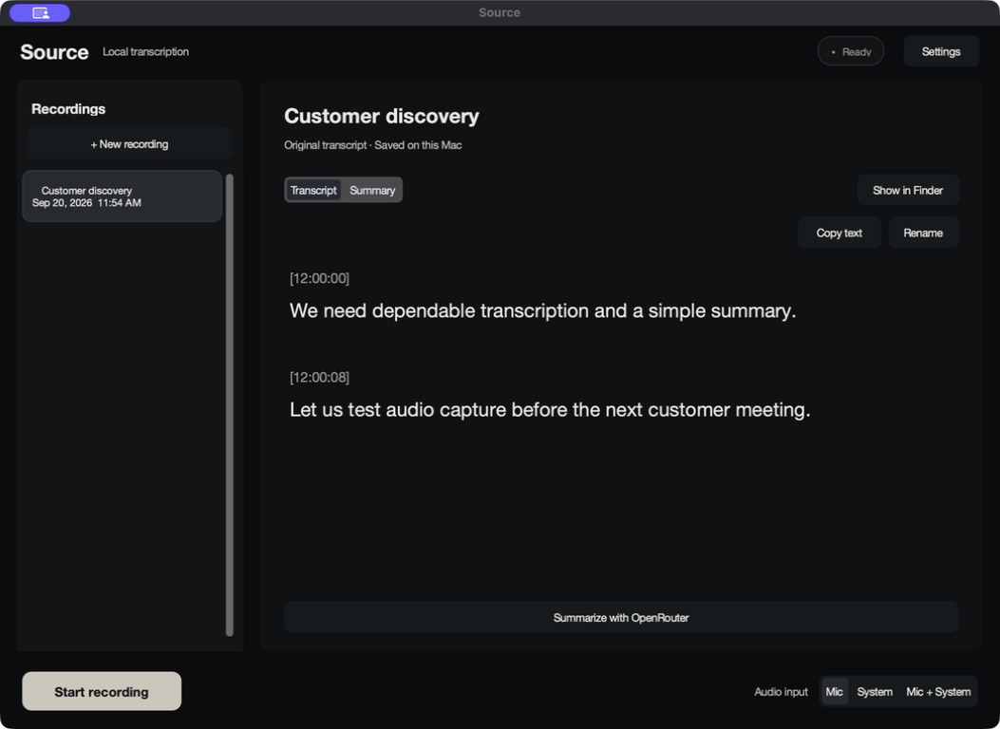
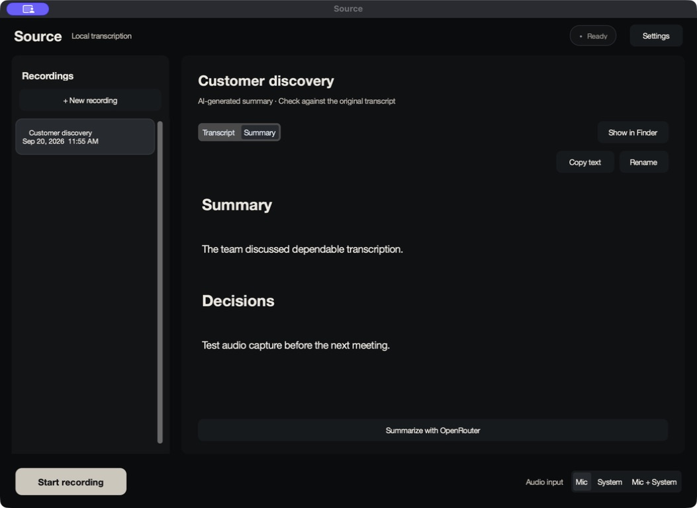
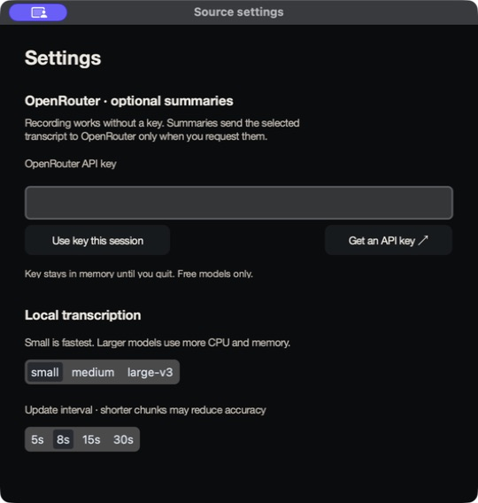
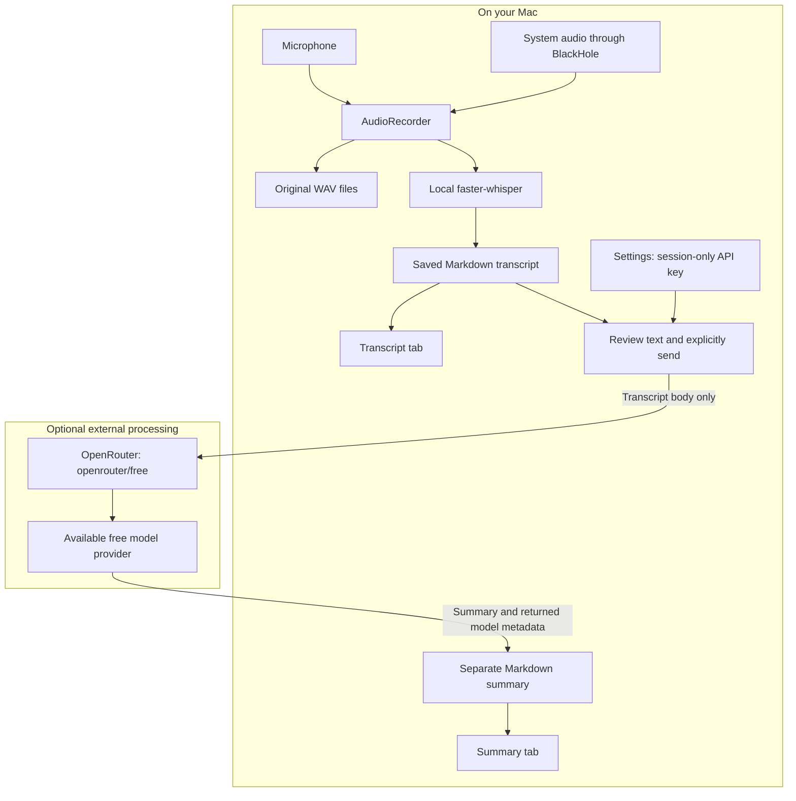

# Source update: a simpler workspace, optional OpenRouter summaries

Source now brings local transcripts and optional summaries into one reading workspace. Recordings have readable titles in a left sidebar, text has more room, and Transcript / Summary tabs keep the original conversation and its brief together.

## The updated interface

These are real app screenshots using synthetic transcript and summary fixtures. They demonstrate the interface, not a live model response. No private recordings or API keys are shown.

### Read the original transcript

### Keep the summary with its recording

### Set up OpenRouter in one place

Open **Settings**, paste an OpenRouter key, and choose **Use key this session**. Select a finished recording and choose **Summarize with OpenRouter**. Review the transcript preview before sending. The key stays in memory until Source quits.

## How it works

Recording and transcription remain local after the model download. OpenRouter is only used for a summary you explicitly request. Audio, device metadata, and local paths are not sent. The selected provider's data-use policies still apply.

Only `openrouter/free` is accepted. Custom routers and paid fallback are disabled. Summaries are saved separately and associated with the transcript's content, so renaming a recording does not disconnect its summary. The original transcript remains unchanged.

## Small reliability improvements

- A recording shows elapsed time and signal activity for each selected input.
- A visible warning identifies a system input that has received no signal.
- Near-silence filtering checks short frames, preserving brief quiet signals that would be diluted by a whole-chunk average. Very faint speech remains a limitation; original audio is retained.
- Long transcripts remain readable locally even when they exceed the summary request limit.

## Verification and scope

Ten regression tests pass, and a synthetic UI smoke covers setup, sending, saved results, transcript preservation and the finishing-state guard. The macOS app has been built and visually checked. Live OpenRouter inference and live-call capture are still unverified; screenshots must not be treated as evidence of either.

This update is on PR #1's feature branch. It has not been merged into the default branch or published as a release.
